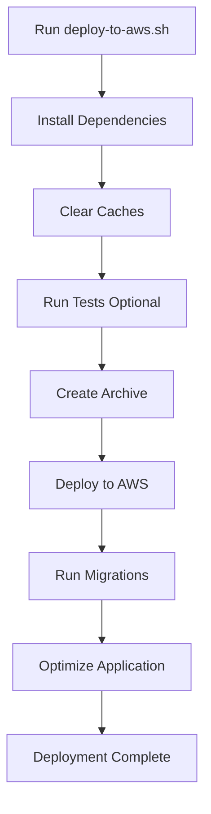

# AWS Deployment Files - Complete Package
## JV Prophecy Manager

This directory contains all necessary files and documentation for deploying the JV Prophecy Manager application to AWS Elastic Beanstalk with RDS MySQL database.

---

## 📁 Files Included

### Documentation (4 files):
1. **`AWS_DEPLOYMENT_MANUAL.md`** (12 sections, ~500 lines)
   - Complete deployment guide with AWS setup
   - Step-by-step instructions
   - Troubleshooting guide
   - Cost estimates

2. **`AWS_QUICKSTART.md`** 
   - 30-minute quick deployment guide
   - Essential commands only
   - For experienced users

3. **`DEPLOYMENT_CHECKLIST.md`**
   - Pre-deployment checklist
   - Deployment verification steps
   - Post-deployment tasks
   - Rollback procedures

4. **`README-AWS-DEPLOYMENT.md`** (this file)
   - Overview of all deployment files

### Configuration Files (11 files):

#### Elastic Beanstalk Extensions (`.ebextensions/`):
1. **`01-packages.config`** - System packages & Composer
2. **`02-laravel.config`** - Laravel-specific configuration
3. **`03-cron.config`** - Laravel Scheduler cron jobs
4. **`04-supervisor.config`** - Queue workers configuration
5. **`05-https.config`** - SSL/HTTPS configuration
6. **`06-monitoring.config`** - CloudWatch monitoring

#### Platform Hooks (`.platform/`):
7. **`nginx/conf.d/laravel.conf`** - Nginx web server configuration
8. **`hooks/postdeploy/01_optimize.sh`** - Post-deployment optimization script

#### EB Configuration:
9. **`.elasticbeanstalk/config.yml`** - EB CLI configuration
10. **`.ebignore`** - Files to exclude from deployment

### AWS Configuration Files (`aws-configs/`):
11. **`s3-bucket-policy.json`** - S3 bucket access policy
12. **`iam-policy.json`** - IAM user/role permissions

### Database Files (`database/sql/`):
13. **`aws-rds-init.sql`** - RDS MySQL initialization script

### Deployment Scripts:
14. **`deploy-to-aws.sh`** - Automated deployment script (bash)

### Environment Templates:
15. **`.env.aws.example`** - AWS environment variables template

---

## 🚀 Quick Start

### For First-Time Deployment:

```bash
# 1. Read the manual (10 minutes)
cat AWS_DEPLOYMENT_MANUAL.md

# 2. Follow quick start (30 minutes)
cat AWS_QUICKSTART.md

# 3. Use the deployment script
chmod +x deploy-to-aws.sh
./deploy-to-aws.sh
```

### For Subsequent Deployments:

```bash
# Option 1: Use deployment script
./deploy-to-aws.sh

# Option 2: Manual deployment
eb deploy jv-prophecy-prod
```

---

## 📋 Prerequisites

### Required Tools:
- ✅ AWS CLI installed
- ✅ EB CLI installed
- ✅ Composer installed
- ✅ Git installed

### Required AWS Resources:
- ✅ AWS Account
- ✅ IAM User with permissions
- ✅ RDS MySQL database
- ✅ S3 bucket
- ✅ (Optional) ACM SSL certificate

---

## 📂 Directory Structure

```
VSK-JV-Prophecy/
├── .ebextensions/              # EB configuration files
│   ├── 01-packages.config
│   ├── 02-laravel.config
│   ├── 03-cron.config
│   ├── 04-supervisor.config
│   ├── 05-https.config
│   └── 06-monitoring.config
│
├── .platform/                   # Platform-specific configurations
│   ├── nginx/
│   │   └── conf.d/
│   │       └── laravel.conf
│   └── hooks/
│       └── postdeploy/
│           └── 01_optimize.sh
│
├── .elasticbeanstalk/          # EB CLI configuration
│   └── config.yml
│
├── aws-configs/                 # AWS service configurations
│   ├── s3-bucket-policy.json
│   └── iam-policy.json
│
├── database/sql/                # Database scripts
│   └── aws-rds-init.sql
│
├── .ebignore                    # EB deployment exclusions
├── deploy-to-aws.sh            # Automated deployment script
├── .env.aws.example            # Environment template
│
└── Documentation/
    ├── AWS_DEPLOYMENT_MANUAL.md
    ├── AWS_QUICKSTART.md
    ├── DEPLOYMENT_CHECKLIST.md
    └── README-AWS-DEPLOYMENT.md
```

---

## 🔧 Configuration Overview

### 1. `.ebextensions/` - What Each File Does:

| File | Purpose |
|------|---------|
| `01-packages.config` | Installs system packages (git, mysql, ImageMagick, Composer) |
| `02-laravel.config` | Configures PHP settings, runs migrations, optimizes Laravel |
| `03-cron.config` | Sets up Laravel Scheduler to run every minute |
| `04-supervisor.config` | Configures queue workers with Supervisor |
| `05-https.config` | Forces HTTPS, configures SSL certificate |
| `06-monitoring.config` | Enables CloudWatch logs and enhanced health reporting |

### 2. `.platform/` - Custom Platform Configuration:

- **`nginx/conf.d/laravel.conf`**: 
  - Increases upload limits (100MB)
  - Enables gzip compression
  - Adds security headers
  - Configures static asset caching

- **`hooks/postdeploy/01_optimize.sh`**:
  - Clears and caches configuration
  - Optimizes autoloader
  - Sets proper permissions

### 3. AWS Services Configuration:

- **S3 Bucket**: File storage for uploads
- **RDS MySQL**: Application database
- **Elastic Beanstalk**: Application hosting
- **CloudWatch**: Logging and monitoring
- **ACM**: SSL/TLS certificates

---

## 🎯 Deployment Workflow

### Automatic (using script):



### Manual Steps:

1. **Pre-Deployment**:
   ```bash
   composer install --no-dev --optimize-autoloader
   php artisan config:clear
   ```

2. **Deployment**:
   ```bash
   eb deploy jv-prophecy-prod
   ```

3. **Post-Deployment**:
   ```bash
   eb ssh
   cd /var/app/current
   php artisan migrate --force
   php artisan config:cache
   ```

---

## ✅ Verification Steps

After deployment, verify:

1. **Application Health**:
   ```bash
   eb health
   eb status
   ```

2. **Database Connection**:
   ```bash
   eb ssh
   php artisan tinker
   # Run: DB::connection()->getPdo()
   ```

3. **Web Access**:
   ```bash
   eb open
   # Or visit: https://your-environment.elasticbeanstalk.com
   ```

4. **Logs**:
   ```bash
   eb logs
   # Check for errors
   ```

---

## 💰 Cost Management

### Monthly Costs (Estimate):

**Development/Staging**:
- RDS (t3.micro): ~$15
- EB (t3.micro): ~$10
- S3: ~$2
- **Total**: ~$27/month

**Production**:
- RDS (t3.small): ~$25
- EB (t3.small): ~$15
- Load Balancer: ~$18
- S3: ~$3
- Data Transfer: ~$10
- **Total**: ~$71/month

### Cost Optimization Tips:

1. Use Reserved Instances (save 40%)
2. Enable auto-scaling (scale down during low traffic)
3. Use S3 Intelligent-Tiering
4. Implement CloudFront CDN
5. Schedule non-production environments to stop after hours

---

## 🔒 Security Checklist

- [ ] Environment variables set securely (no hardcoded credentials)
- [ ] RDS security group restricts access to EB only
- [ ] S3 bucket has proper permissions
- [ ] SSL/TLS certificate configured
- [ ] HTTPS enforced (HTTP redirects)
- [ ] Security headers configured in Nginx
- [ ] Database backups enabled
- [ ] IAM roles follow least-privilege principle
- [ ] CloudWatch logging enabled
- [ ] Regular security updates scheduled

---

## 📊 Monitoring

### CloudWatch Metrics to Monitor:

1. **Application**:
   - HTTP 4xx/5xx errors
   - Response time
   - Request count

2. **Database**:
   - CPU utilization
   - Database connections
   - Disk space
   - Replication lag (if using read replicas)

3. **Infrastructure**:
   - EC2 instance health
   - Network throughput
   - Storage usage

### Set Up Alarms:

```bash
# See AWS_DEPLOYMENT_MANUAL.md Section 8.2 for alarm configuration
```

---

## 🆘 Support

### Documentation:
- Full Manual: `AWS_DEPLOYMENT_MANUAL.md`
- Quick Start: `AWS_QUICKSTART.md`
- Checklist: `DEPLOYMENT_CHECKLIST.md`

### Common Issues:
See **Section 9: Troubleshooting** in `AWS_DEPLOYMENT_MANUAL.md`

### Contact:
- **Email**: vojmedia@gmail.com
- **AWS Support**: [Support Console](https://console.aws.amazon.com/support/)

---

## 📝 Notes

- **Deployment Time**: First deployment: ~30-45 minutes, subsequent: ~5-10 minutes
- **Downtime**: Zero downtime with load balancer, ~2 minutes single instance
- **Tested On**: PHP 8.2, MySQL 8.0, Amazon Linux 2023
- **Last Updated**: October 11, 2025

---

## 🎓 Learning Resources

- [AWS EB PHP Documentation](https://docs.aws.amazon.com/elasticbeanstalk/latest/dg/php-laravel-tutorial.html)
- [Laravel Deployment Guide](https://laravel.com/docs/10.x/deployment)
- [AWS RDS Best Practices](https://docs.aws.amazon.com/AmazonRDS/latest/UserGuide/CHAP_BestPractices.html)

---

**Ready to Deploy?** Start with `AWS_QUICKSTART.md`! 🚀

